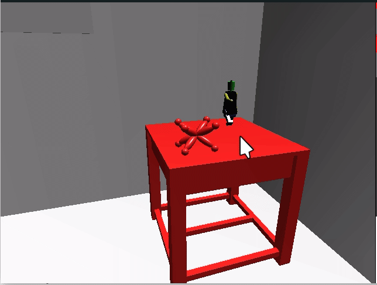

# Room Decoration with OpenGL
This repository is a practice demo of usage of GLUT library to simulate 3D world (table, robot, jack etc.). Compile it with GNU C++ and glut library in the `include`. Also, another library to read image (`stb_image.h`) is used to load images as texture.

## Demonstration

## Keybindings
- "wasd" -> Move around as first person shooting game.
- "ijkl" -> Look around as last person shooting.
- "e" -> Descend.
- "q" -> Ascend.
- "u" -> Rotate camera counter clockwise.
- "o" -> Rotate camera clockwise.
- "f" -> Increase FOV (Field of View)
- "F" -> Decrease FOV (Field of View)
- "m" -> Toggle point light (Displayed with a sphere in the scene).
- "M" -> Toggle directional light (Displayed with a cone in the scene).
- "b" -> Increase the depth of Fractal in the left wall.
- "B" -> Decrease the depth of Fractal in the left wall.
- "z" -> Scale everything bigger (+0.2 units).
- "Z" -> Scale everything smaller (-0.2 units).